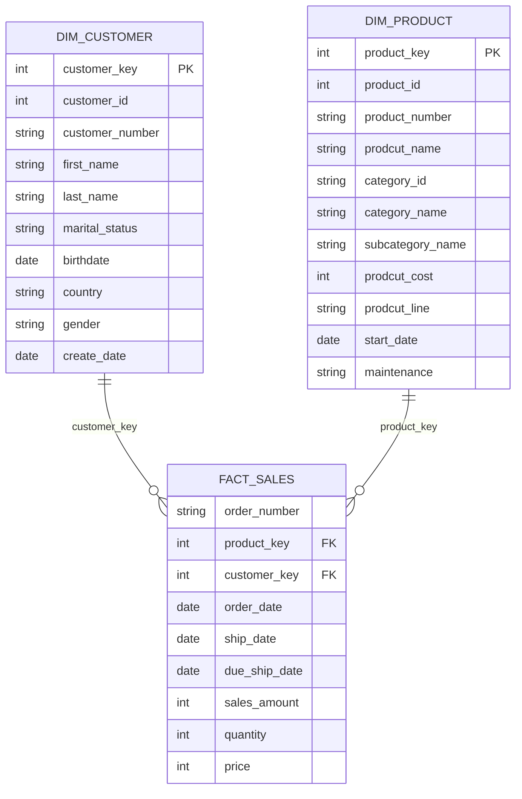

# Gold Layer Data Catalog

This catalog documents the three Gold-layer objects: two dimension views and one fact view, built on top of the Silver layer (CRM + ERP sources). Gold is the presentation layer — modeled as a simple star schema for reporting and analytics.

---

## 1. `gold.dim_customer`

**Type:** View (Dimension)
**Grain:** One row per customer
**Surrogate key:** `customer_key`
**Source tables:** `silver.crm_cust_info`, `silver.erp_cust_az12`, `silver.erp_loc_a101`

| Column | Data Type | Description | Example |
|---|---|---|---|
| `customer_key` | `INT` | Surrogate key generated by `ROW_NUMBER()` ordered by `cst_id`. Unique, sequential identifier used to join to `fact_sales`. Not a business key — has no meaning outside the warehouse. | `1` |
| `customer_id` | `INT` | Business/source key from CRM (`cst_id`). Uniquely identifies a customer in the source system. | `11000` |
| `customer_number` | `NVARCHAR(50)` | Alternate customer identifier/code from CRM (`cst_key`), used to join across CRM and ERP source systems. | `AW00011000` |
| `first_name` | `NVARCHAR(50)` | Customer's first name. | `Jon` |
| `last_name` | `NVARCHAR(50)` | Customer's last (family) name. | `Yang` |
| `marital_status` | `NVARCHAR(50)` | Customer's marital status, standardized from the CRM source code (e.g. `S`/`M` decoded to full text in Silver). | `Married` |
| `birthdate` | `DATE` | Customer's date of birth, sourced from ERP (`erp_cust_az12.bdate`). Defaulted to `1900-01-01` when missing/unavailable. | `1971-10-06` |
| `country` | `NVARCHAR(50)` | Customer's country of residence, sourced from ERP location data (`erp_loc_a101.cntry`). | `Australia` |
| `gender` | `NVARCHAR(50)` | Customer's gender. CRM is treated as the master/trusted source; if CRM value is `n/a`, falls back to the ERP value, defaulting to `n/a` if both are missing. | `Male` |
| `create_date` | `DATE` | Date the customer record was created in the source CRM system. | `2025-10-06` |

---

## 2. `gold.dim_prodcut`

**Type:** View (Dimension)
**Grain:** One row per *currently active* product (historical/expired product versions are filtered out via `prd_end_dt IS NULL`)
**Surrogate key:** `product_key`
**Source tables:** `silver.crm_prd_info`, `silver.erp_px_cat_g1v2`

| Column | Data Type | Description | Example |
|---|---|---|---|
| `product_key` | `INT` | Surrogate key generated by `ROW_NUMBER()` ordered by `prd_start_dt, prd_key`. Used to join to `fact_sales`. | `1` |
| `product_id` | `INT` | Business/source key from CRM (`prd_id`), uniquely identifying the product in the source system. | `210` |
| `product_number` | `NVARCHAR(50)` | Product code/SKU (`prd_key`) used to join sales transactions to this dimension. | `FR-R92B-58` |
| `prodcut_name` | `NVARCHAR(50)` | Descriptive name of the product. *(Note: column name carries a typo — "prodcut" instead of "product".)* | `HL Road Frame - Black- 58` |
| `category_id` | `NVARCHAR(50)` | Category code linking to the ERP category reference table (`erp_px_cat_g1v2.id`). | `CO_RF` |
| `category_name` | `NVARCHAR(50)` | Human-readable product category, from ERP category reference data. | `Components` |
| `subcategory_name` | `NVARCHAR(50)` | Human-readable product sub-category, from ERP category reference data. | `Road Frames` |
| `prodcut_cost` | `INT` | Standard/base cost of the product. *(Note: column name carries a typo.)* | `0` |
| `prodcut_line` | `NVARCHAR(50)` | Product line/family classification (e.g. Road, Mountain). *(Note: column name carries a typo.)* | `Road` |
| `start_date` | `DATE` | Date this version of the product became effective/active. | `2003-07-01` |
| `maintenance` | `NVARCHAR(50)` | Indicates whether the product requires maintenance, from ERP category reference data. | `Yes` |

---

## 3. `gold.fact_sales`

**Type:** View (Fact)
**Grain:** One row per sales order line item
**Foreign keys:** `product_key` → `gold.dim_prodcut`, `customer_key` → `gold.dim_customer`
**Source table:** `silver.crm_sales_details` (joined to both dimensions)

| Column | Data Type | Description | Example |
|---|---|---|---|
| `order_number` | `NVARCHAR(50)` | Sales order identifier from the source system. Multiple rows can share an order number if the order has multiple line items. | `SO43697` |
| `product_key` | `INT` | Foreign key to `gold.dim_prodcut.product_key`, resolved by joining on product number/code. | `32` |
| `customer_key` | `INT` | Foreign key to `gold.dim_customer.customer_key`, resolved by joining on customer ID. | `10769` |
| `order_date` | `DATE` | Date the order was placed. | `2010-12-29` |
| `ship_date` | `DATE` | Date the order was shipped. | `2011-01-05` |
| `due_ship_date` | `DATE` | Date the order was due/expected to be shipped. | `2011-01-10` |
| `sales_amount` | `INT` | Total monetary value of the line item (quantity × price, as recorded in source). | `3578` |
| `quantity` | `INT` | Number of units sold for this line item. | `1` |
| `price` | `INT` | Unit price of the product at time of sale. | `3578` |

---

## Model Overview

### Notes / Recommendations
- Both `dim_prodcut` and columns like `prodcut_name`, `prodcut_cost`, `prodcut_line` carry a spelling inconsistency ("prodcut" instead of "product") — worth fixing for consistency and to avoid confusing BI tool users.
- `sales_amount` and `price` are typed as `INT` based on the sample data shown (no decimals present); if actual currency values can include cents, these should be `DECIMAL(18,2)` instead.
- `dim_prodcut` only exposes currently active products (`prd_end_dt IS NULL`), so `fact_sales` joins to it will not resolve `product_key` for historical/discontinued product versions — consider whether historical tracking (SCD Type 2) is needed.
