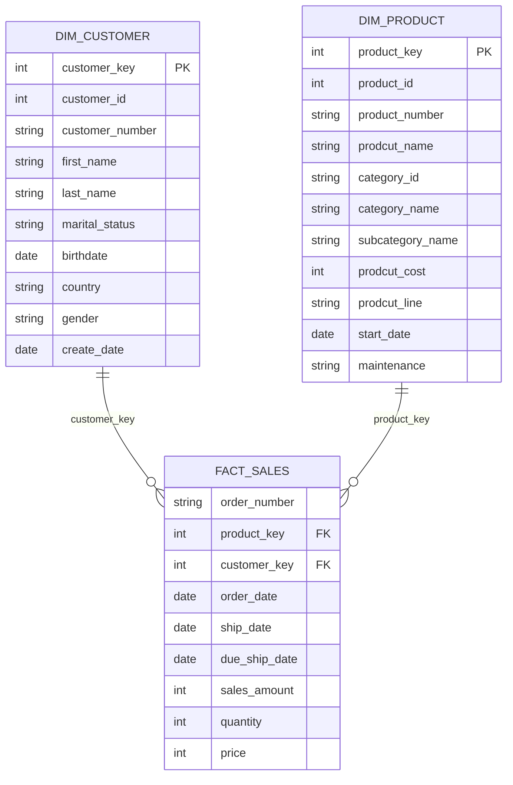

#ata Modeling 

## Model Overview

```mermaid
erDiagram
    DIM_CUSTOMER ||--o{ FACT_SALES : "customer_key"
    DIM_PRODUCT  ||--o{ FACT_SALES : "product_key"

    DIM_CUSTOMER {
        int customer_key PK
        int customer_id
        string customer_number
        string first_name
        string last_name
        string marital_status
        date birthdate
        string country
        string gender
        date create_date
    }

    DIM_PRODUCT {
        int product_key PK
        int product_id
        string product_number
        string prodcut_name
        string category_id
        string category_name
        string subcategory_name
        int prodcut_cost
        string prodcut_line
        date start_date
        string maintenance
    }

    FACT_SALES {
        string order_number
        int product_key FK
        int customer_key FK
        date order_date
        date ship_date
        date due_ship_date
        int sales_amount
        int quantity
        int price
    }
```

resolve `product_key` for historical/discontinued product versions — consider whether historical tracking (SCD Type 2) is needed.
